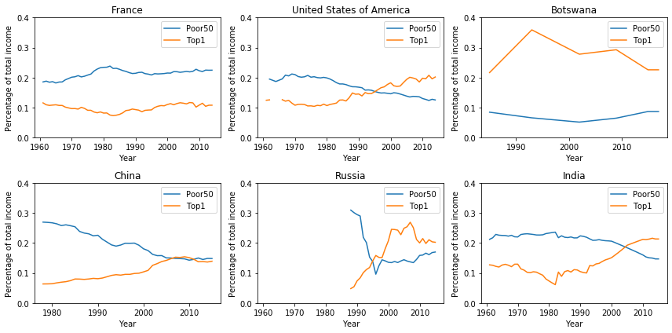
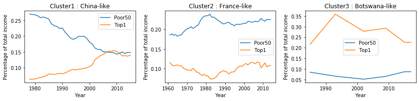

In order to dig inside this question, we decide to study how income is distributed in the different countries.

Indeed, in previous analyses, we discovered how some countries are more responsible for the production in term of crops and livestock. Production causes emission of CO2, which is one of the main causes of Climate Change. 

Of course, we cannot target the production as *bad* a priori: indeed, production is important for the economy and overall wealth of a country. However, it could be important to analyze how income and wealth is distributed within each country among its inhabitants, i.e. inspect how economic resources earned by productive activities are split.

A quite common phenomenon that can be detected in many countries all over the world is the so called **Matthew Effect**, which can be summarized in the sentence *the rich gets richer and the poor gets poorer*.

We were interested in the behaviour of those countries which are involved the most in the production of CO2. From the map and from the plots below, we can see how they suffer of the **Matthew Effect**.

*The blue line in the plot showed above represents the percentage of total amount of income that is earned by the `Bottom 50% percent` (the poorests), while the orange  the one of the `Top 1%` (the richests) of the population of a given country.*

These plots well explain the effect we were describing above, which is evolving faster and faster in recent years. While in European countries (that have France as a representative country) managed to contain the phenomenon, developing countries like China or India are having great issues in controlling it. Interestingly enough, United States have a situation nearer to developing countries than to big economies like European ones: the gap between the rich and the poor part of the population is becoming more and more wide in recent years. Finally, Russian situation clearly describes what happened after the end of URRS.

## Clustering countries: which areas show similar patterns?

K-means is used to determine the optimal 3 clusters among the countries. we can see a representative for each of them in the image below.

So finally this is the world with each country having a colour that corresponds to the cluster it's been assigned to. Cluster 0 is made of the country for which we have no data.

The choropleth map helps us with the visualization of the clusters. We can easily see how the European countries were clustered together, such as most of the developing countries like Brazil or India. 

We were interested on the behaviour of those countries which are involved the most in the production of CO2. From the map and from the plots below, we can see how they suffer of the **Matthew Effect**.

This leads to consider these countries as top level not only in terms of agriculture and livestock prodcution, but also in terms of income inequality. 

    <iframe id="graph" src="country_clustering.html" width="1000" height="500"  frameborder="0">

  